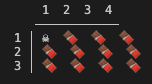
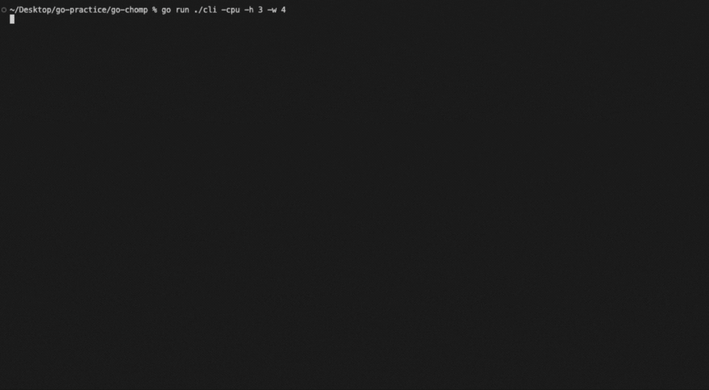

## Overview 
This is a pet project I have recreated in Golang to get comfortable with Golang as a new language for me. Inspired by a project I made in college, and by the great David Gale, the game of Chomp is a two-player, mathematical strategy game played on a rectangular grid, or a ~chocolate bar~, where the player forced to eat the poisoned top-left square loses. Please see instructions for details on cloning and playing.



This repository is meant to be a stepping stone to making this game into a fun interactive component on my personal site. If you don't see a link to my personal site somewhere in this readme, it means I have yet to complete it. Check back soon! 


## Instructions

### Clone and set up
```bash
git clone https://github.com/keylanpetty/go-chomp.git
cd go-chomp
```

### Make sure you have Go 1.20+ installed:

```bash 
go version
```


### Run directly (no install)
From the root folder (go-chomp):

```bash
go run ./cmd/chomp
```

Optional flags:
**-w and -h — board width and height (defaults: 6×5).**
**-cpu — play against a simple computer opponent. Omit for human-vs-human.**
<!-- TODO: CPU difficulty level  -->

```bash
go run ./cmd/chomp -w 8 -h 6 -cpu
```

Build a standalone binary
```bash
go build -o chomp ./cmd/chomp
./chomp -cpu
```

Install globally (optional)
```bash
go install ./cmd/chomp
```

Ensure $(go env GOPATH)/bin is in your PATH, then you can run:
```bash
chomp -cpu
```
from anywhere.

## Sample Gameplay

